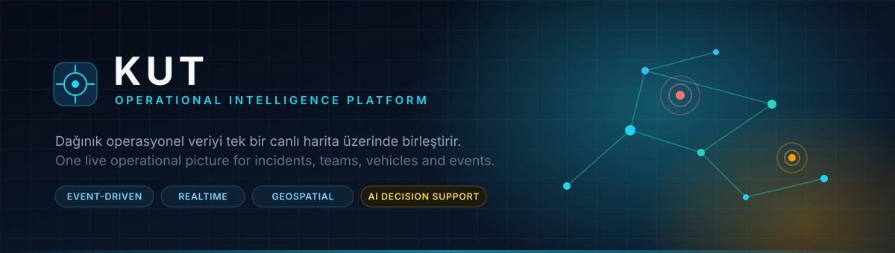
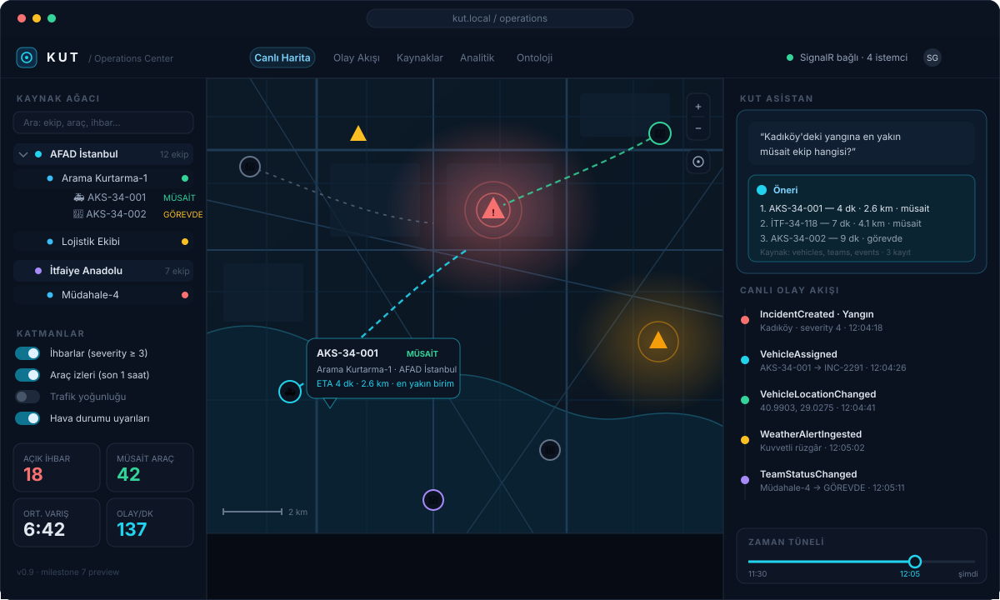
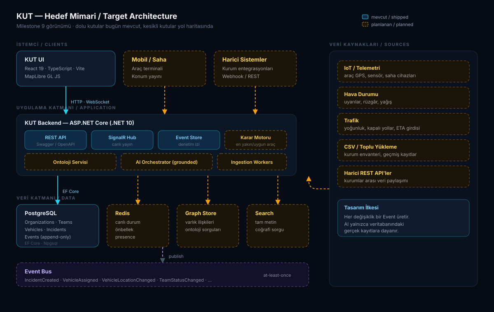
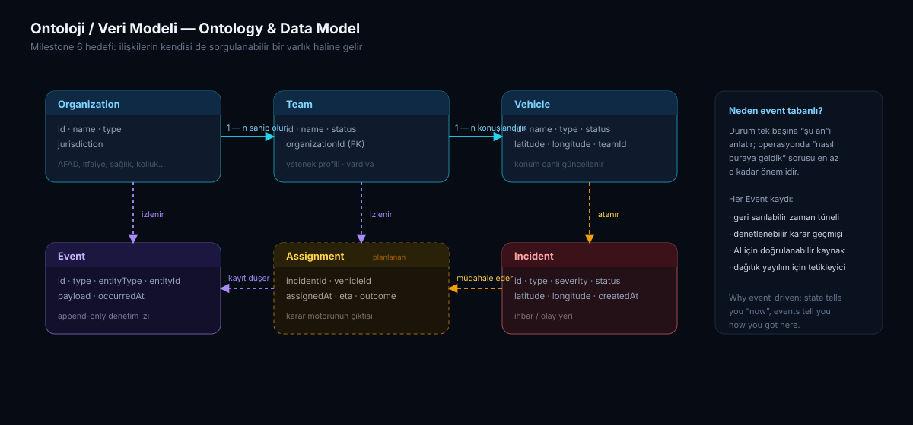
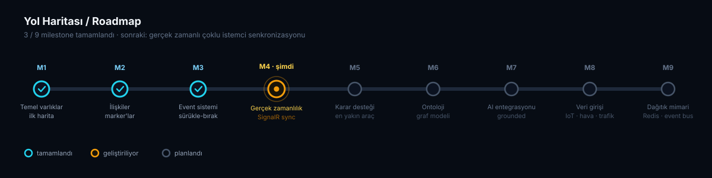

<div align="center">



<br>

> **Türkiye'nin operasyonel istihbarat platformu** · An operational intelligence platform for real-time incident, resource, and event management.

[](https://github.com/sametgurtuna/KUT)
[](https://dotnet.microsoft.com/)
[](https://react.dev/)
[](https://www.typescriptlang.org/)
[](https://www.postgresql.org/)
[](https://maplibre.org/)
[](https://learn.microsoft.com/aspnet/core/signalr/introduction)
[](#yol-haritası)
[](#lisans)

🌐 **Language / Dil:** [Türkçe](#türkçe) · [English](#english)

</div>

> [!NOTE]
> Bu README'deki arayüz ve mimari görselleri, projenin **hedeflenen (gelecek) halini** gösteriyor; bugünkü kod tabanının ekran görüntüleri değil. Şu an neyin hazır olduğunu [Yol Haritası](#yol-haritası) bölümünden takip edebilirsin.
> _The UI and architecture visuals in this README depict the **target (future) state** of the product, not screenshots of the current codebase. See the [Roadmap](#roadmap) for what ships today._

---

## Türkçe

### KUT Nedir?

KUT, gerçek dünyadaki operasyonel varlıkları (organizasyonlar, ekipler, araçlar, ihbarlar) tek bir canlı harita üzerinde modelleyen, olay tabanlı (event-driven) bir istihbarat/karar destek platformudur. Amaç, dağınık verileri (konum, durum, geçmiş) tek bir operasyonel görünüme (single pane of glass) dönüştürmektir.

|  | |
| :-- | :-- |
| 🗺️ **Tek operasyonel görünüm** | Organizasyon, ekip, araç ve ihbarlar aynı canlı harita üzerinde |
| ⚡ **Olay tabanlı çekirdek** | Her anlamlı değişiklik `Events` tablosuna denetim izi olarak düşer |
| 📡 **Gerçek zamanlı** | SignalR ile bağlı tüm istemciler aynı anda güncellenir |
| 🧭 **Karar desteği** | En yakın/uygun aracı öneren operasyonel akıl _(yol haritasında)_ |
| 🤖 **Doğrulanabilir AI** | Yapay zeka yalnızca veritabanındaki gerçek kayıtlara dayanır _(yol haritasında)_ |

### Operasyon Merkezi (hedef arayüz)

<div align="center">

</div>

Solda organizasyon → ekip → araç kaynak ağacı ve katman filtreleri; ortada ihbar yoğunluğu, araç konumları ve önerilen atama rotalarıyla canlı harita; sağda doğal dille sorgulanabilen asistan, canlı olay akışı ve geriye sarılabilen zaman tüneli.

### Mimari

<div align="center">

</div>

Bugünkü çekirdek akış, sade bir üç katmandan ibarettir:

```
┌─────────────────────┐        HTTP / WebSocket        ┌─────────────────────┐
│       KUT UI         │ ──────────────────────────────▶ │     KUT Backend      │
│  React + TypeScript  │ ◀────────────────────────────── │    ASP.NET Core      │
│      MapLibre GL      │          SignalR (realtime)     │      + SignalR       │
└─────────────────────┘                                  └──────────┬──────────┘
                                                                     │
                                                              Entity Framework Core
                                                                     │
                                                                     ▼
                                                          ┌─────────────────────┐
                                                          │      PostgreSQL      │
                                                          │  Organizations       │
                                                          │  Teams               │
                                                          │  Vehicles            │
                                                          │  Incidents           │
                                                          │  Events              │
                                                          └─────────────────────┘
```

### Veri Modeli

<div align="center">

</div>

**Veri modeli mantığı:**

```
Organization ──▶ Team ──▶ Vehicle
Incident                          (konum + tip + önem derecesi)
Event        (sistemdeki her önemli değişikliğin denetim izi)
```

### Teknoloji Yığını

| Katman             | Teknoloji                                              |
| ------------------ | ------------------------------------------------------ |
| Backend            | ASP.NET Core (.NET 10), Entity Framework Core, SignalR |
| Veritabanı         | PostgreSQL (Npgsql sürücüsü)                           |
| Frontend           | React 19, TypeScript, Vite                             |
| Harita             | MapLibre GL JS                                         |
| API Dokümantasyonu | Swagger / OpenAPI                                      |
| Versiyon Kontrol   | Git                                                    |

### Kurulum

**Gereksinimler:** .NET 8+ SDK, Node.js (LTS), PostgreSQL, Git.

**1. Depoyu klonla**

```bash
git clone https://github.com/sametgurtuna/KUT.git
cd KUT
```

**2. Backend'i ayağa kaldır**

```bash
cd backend/KUT.Api
dotnet restore
```

`appsettings.json` içindeki `ConnectionStrings:DefaultConnection` alanını kendi PostgreSQL kullanıcı adı/şifrenle güncelle, sonra:

```bash
dotnet ef database update
dotnet run
```

Backend varsayılan olarak `http://localhost:5144` üzerinde ayağa kalkar (port farklı olabilir, konsol çıktısını kontrol et). Swagger arayüzü: `http://localhost:5144/swagger`.

**3. Frontend'i ayağa kaldır**

```bash
cd ../../frontend
npm install
npm run dev
```

Frontend `http://localhost:5173` adresinde çalışır.

> [!WARNING]
> `frontend/src/App.tsx` içindeki API adresinin (`http://localhost:5144`) backend'in gerçek portuyla eşleştiğinden emin ol.

### API Uç Noktaları

| Metod   | Endpoint                      | Açıklama                                                                                           |
| ------- | ----------------------------- | -------------------------------------------------------------------------------------------------- |
| `GET`   | `/api/incidents`              | Tüm ihbarları listeler                                                                             |
| `GET`   | `/api/organizations`          | Organizasyonları ve bağlı ekiplerini listeler                                                      |
| `GET`   | `/api/teams`                  | Ekipleri ve bağlı araçlarını listeler                                                              |
| `GET`   | `/api/vehicles`               | Araçları ve bağlı ekiplerini listeler                                                              |
| `PATCH` | `/api/vehicles/{id}/location` | Araç konumunu günceller, `Events` tablosuna kayıt düşer, bağlı istemcilere SignalR ile yayın yapar |

### Yol Haritası

<div align="center">

</div>

- [x] **Milestone 1:** Temel varlıklar (Incident), ilk endpoint, ilk harita
- [x] **Milestone 2:** İlişkiler (Organization → Team → Vehicle), harita marker'ları
- [x] **Milestone 3:** Event sistemi (konum güncelleme + denetim izi + sürükle-bırak)
- [ ] **Milestone 4:** Gerçek zamanlılık (SignalR ile çoklu istemci senkronizasyonu)
- [ ] **Milestone 5:** Operasyonel karar desteği (en yakın/uygun araç önerisi)
- [ ] **Milestone 6:** Ontoloji / graf modeli
- [ ] **Milestone 7:** Yapay zeka entegrasyonu (yalnızca gerçek veritabanı verisiyle)
- [ ] **Milestone 8:** Veri girişi (CSV, REST API'ler, IoT, hava durumu, trafik)
- [ ] **Milestone 9:** Dağıtık mimari (Redis, Event Bus, arama, graf veritabanı)

### Katkıda Bulunma

Proje şu an aktif geliştirme aşamasında, tek geliştirici tarafından adım adım inşa ediliyor. Katkı süreci ileride netleştirilecek.

### Lisans

Henüz belirlenmedi.

---

## English

### What is KUT?

KUT is an event-driven operational intelligence and decision-support platform that models real-world operational entities (organizations, teams, vehicles, and incidents) on a single live map. The goal is to turn scattered operational data (location, status, history) into one coherent operational picture ("single pane of glass").

|  | |
| :-- | :-- |
| 🗺️ **One operational picture** | Organizations, teams, vehicles and incidents on the same live map |
| ⚡ **Event-driven core** | Every meaningful change is written to `Events` as an audit trail |
| 📡 **Realtime** | All connected clients stay in sync over SignalR |
| 🧭 **Decision support** | Suggests the nearest available unit _(on the roadmap)_ |
| 🤖 **Grounded AI** | The assistant answers strictly from real database facts _(on the roadmap)_ |

### Operations Center (target UI)

<div align="center">

</div>

Left: the organization → team → vehicle resource tree plus layer filters. Center: the live map with incident heat, vehicle positions and suggested assignment routes. Right: a natural-language assistant, the live event feed, and a scrubbable timeline.

### Architecture

<div align="center">

</div>

Today's core flow is a straightforward three-tier setup:

```
┌─────────────────────┐        HTTP / WebSocket        ┌─────────────────────┐
│       KUT UI          │ ──────────────────────────────▶ │     KUT Backend      │
│  React + TypeScript  │ ◀────────────────────────────── │    ASP.NET Core      │
│      MapLibre GL       │          SignalR (realtime)     │      + SignalR        │
└─────────────────────┘                                  └──────────┬──────────┘
                                                                     │
                                                              Entity Framework Core
                                                                     │
                                                                     ▼
                                                          ┌─────────────────────┐
                                                          │      PostgreSQL      │
                                                          │  Organizations       │
                                                          │  Teams               │
                                                          │  Vehicles            │
                                                          │  Incidents            │
                                                          │  Events               │
                                                          └─────────────────────┘
```

### Data Model

<div align="center">

</div>

**Data model logic:**

```
Organization ──▶ Team ──▶ Vehicle
Incident                          (location + type + severity)
Event        (audit trail of every significant change in the system)
```

### Tech Stack

| Layer           | Technology                                             |
| --------------- | ------------------------------------------------------ |
| Backend         | ASP.NET Core (.NET 10), Entity Framework Core, SignalR |
| Database        | PostgreSQL (via Npgsql driver)                         |
| Frontend        | React 19, TypeScript, Vite                             |
| Mapping         | MapLibre GL JS                                         |
| API Docs        | Swagger / OpenAPI                                      |
| Version Control | Git                                                    |

### Getting Started

**Prerequisites:** .NET 8+ SDK, Node.js (LTS), PostgreSQL, Git.

**1. Clone the repo**

```bash
git clone https://github.com/sametgurtuna/KUT.git
cd KUT
```

**2. Run the backend**

```bash
cd backend/KUT.Api
dotnet restore
```

Update `ConnectionStrings:DefaultConnection` in `appsettings.json` with your PostgreSQL credentials, then:

```bash
dotnet ef database update
dotnet run
```

The backend runs at `http://localhost:5144` by default (port may vary, check the console output). Swagger UI: `http://localhost:5144/swagger`.

**3. Run the frontend**

```bash
cd ../../frontend
npm install
npm run dev
```

The frontend runs at `http://localhost:5173`.

> [!WARNING]
> Make sure the API base URL in `frontend/src/App.tsx` (`http://localhost:5144`) matches your backend's actual port.

### API Endpoints

| Method  | Endpoint                      | Description                                                                                            |
| ------- | ----------------------------- | ------------------------------------------------------------------------------------------------------ |
| `GET`   | `/api/incidents`              | List all incidents                                                                                     |
| `GET`   | `/api/organizations`          | List organizations with their teams                                                                    |
| `GET`   | `/api/teams`                  | List teams with their vehicles                                                                         |
| `GET`   | `/api/vehicles`               | List vehicles with their team                                                                          |
| `PATCH` | `/api/vehicles/{id}/location` | Update a vehicle's location, log an `Event`, and broadcast the change to connected clients via SignalR |

### Roadmap

<div align="center">

</div>

- [x] **Milestone 1:** Core entities (Incident), first endpoint, first map
- [x] **Milestone 2:** Relationships (Organization → Team → Vehicle), map markers
- [x] **Milestone 3:** Event system (location updates + audit trail + drag-and-drop)
- [ ] **Milestone 4:** Realtime (SignalR multi-client sync)
- [ ] **Milestone 5:** Operational decision support (nearest/available vehicle recommendations)
- [ ] **Milestone 6:** Ontology / graph model
- [ ] **Milestone 7:** AI integration (grounded strictly in real database facts)
- [ ] **Milestone 8:** Data ingestion (CSV, REST APIs, IoT, weather, traffic)
- [ ] **Milestone 9:** Distributed architecture (Redis, event bus, search, graph store)

### Contributing

The project is currently under active, solo development, built incrementally. Contribution guidelines will be defined later.

### License

Not yet decided.

<div align="center">
<br>
<sub>KUT · built step by step, one milestone at a time.</sub>
<br>
<sub><a href="https://github.com/sametgurtuna/KUT">github.com/sametgurtuna/KUT</a></sub>
</div>
